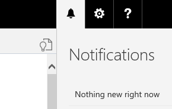

<properties
	pageTitle="What's New in Project “Madeira”| Project “Madeira”"
    description="What's New" 
	services="project-madeira" 
	documentationCenter=""
	authors="edupont04"/>
<tags
    ms.service="project-madeira"
    ms.topic="article"
    ms.devlang="na"
    ms.tgt_pltfrm="na"
    ms.workload="Madeira"
    ms.date="05/12/2016"
    ms.author="edupont04" />
    
# What's New in Project "Madeira" 
We hope you already got started with Project "Madeira". This is still a preview only, but we have added capabilities that we hope you find interesting.  
Sign up for the preview, let us walk you through the basics of what you can do with Project "Madeira", and then try things out on your own for a while. When you are ready, you can open a blank company and set things up for yourself. Optionally, you can import your own business data to the company.  
  
On a regular basis, we will update Project "Madeira" with additional capabilities in the core application and with new [extensions](ui-extensions.md). 
   
## May 2016 Update
With the May update of Project "Madeira", new extensions have been added. Examples are Sana Commerce for Project "Madeira" that provides B2B Commerce capabilities, and ChargeLogic Payments that provides payment and credit card processing capabilities.  
  
This is just the beginning, several partners in our ecosystem are lined up to provide additional extensions to make sure Project "Madeira" is the choice for growing companies. It's your choice to use any of the new extensions - they make your Project "Madeira" truly your own because you know better than anyone if the capabilities in an extension will help you in your business.  
  
For a brief introduction to each of the new, powerful extensions to the core functionality in Project "Madeira", see [Project “Madeira” Extensions by Other Providers](ui-extensions-other.md).  
  
### Filter on unprocessed incoming documents
We have also changed some core functionality in this month's update: The list of incoming documents is now filtered to show only entries that have not been used to create posted documents with.  
  
To reduce the amount of entries in the incoming documents list page, we have added a processed field, and now filter to show only unprocessed incoming documents in the list. You can choose to view all incoming documents in the list if desired, using the show Show All action. When documents are posted, the processed flag is set to Yes, such that incoming documents that have been processed into posted documents are filtered out. You can also manually switch the processing flag.  
For more information, see [Manage Incoming Documents](across-income-documents.md)  

### Office Suite notifications are now enabled in Project "Madeira"
Project "Madeira" is part of the Office experience, as you have seen, the May update enables Office notifications. In the top right corner, next to the Settings menu, you will notice the bell symbol that you probably already know well from other Office products: That's the Notifications menu.  
  
Here you will receive notifications such as new mail and calendar reminders directly while working in Project "Madeira".  
  
## April 2016 Preview
In April 2016, we launched the preview of Project "Madeira". Everything was new, and we encouraged you to start the Getting Started guide in the demonstration company that you get access to when you first sign up. The Getting Started guide steps you through key scenarios. For more information, see [Welcome to Project "Madeira"](madeira-get-started.md).  
  
Key scenarios to try out on your own:  

- [Using Project “Madeira” as your Business Inbox in Outlook](madeira-no-outlook.md)  
- [Get Project "Madeira" on my Mobile Device](install-mobile-app.md)  
- [Using the Project “Madeira” Content Pack for Power BI](madeira-powerbi.md)  
- [Changing the Role Center](change-role.md)  
  

## See Also
[Welcome to Project "Madeira"](madeira-get-started.md)  
[Work With Project "Madeira"](ui-work-product.md)  

